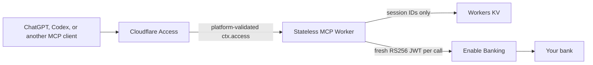

# EU Open Banking MCP

A self-hosted, read-only MCP server for accessing personal European bank accounts through [Enable Banking](https://enablebanking.com/), secured and deployed on Cloudflare Workers.

[](https://deploy.workers.cloudflare.com/?url=https://github.com/cver-me/eu-open-banking-mcp)

This is not a generic Open Banking proxy. MCP clients can list authorized accounts, read balances and transactions, search transaction text, and summarize cash flow. They cannot select arbitrary provider endpoints, authorize or remove bank sessions, or initiate payments.

> [!IMPORTANT]
> Treat every deployment as a private financial system. The repository is open source; your Worker, MCP URL, secrets, session IDs, account IDs, and financial data are private.

## Why this exists

[ChatGPT Finances](https://openai.com/index/personal-finance-chatgpt/) shows what becomes possible when an assistant can reason over real balances and transactions. Its account connection is powered by Plaid and is currently available in the United States.

We built this project because we could not find a comparably direct, self-hostable path for European personal accounts. Europe has Open Banking, but individuals still reach bank data through regulated providers whose production onboarding and APIs vary. [Plaid's published MCP servers](https://plaid.com/docs/resources/mcp/) are useful for developer tooling and production diagnostics; they do not expose a person's balances and transactions as personal-finance MCP tools.

This project fills that narrow gap: one person deploys one private MCP, authorizes only their own bank accounts, and lets their chosen MCP clients perform bounded read-only analysis. It is infrastructure for personal use, not a hosted financial product or a multi-user aggregator.

## Why Enable Banking

Of the providers evaluated, Enable Banking offered the simplest fit for a self-hosted personal deployment. Its restricted-production mode explicitly allows an application to be activated by linking the owner's own accounts before signing a commercial agreement, including for individual non-commercial use. The application can then read only those linked accounts. See Enable Banking's [restricted-production account guide](https://enablebanking.com/docs/api/linked-accounts).

That model matches this project's security boundary:

- the Enable Banking dashboard is the account whitelist;
- the bank's authorization flow creates the revocable API consent;
- the MCP exposes only fixed read operations over accounts covered by both.

Dashboard linking is not itself API authorization. After deployment, `/setup` still sends the owner through their bank's consent flow and stores the resulting Enable Banking session ID. This second step is required even when the same account was already linked in the dashboard.

## Architecture



- Client → MCP: Cloudflare Access Managed OAuth, restricted to the deployment owner.
- MCP → Enable Banking: a one-hour RS256 JWT signed from a private key stored as a Worker secret.
- Storage: KV contains only Enable Banking session IDs created through the protected setup flow.
- Online account reads: the Worker forwards Cloudflare's connecting-client IP and the MCP client's
  User-Agent as Enable Banking's `Psu-Ip-Address` and `Psu-User-Agent` headers. These request-scoped
  values are not stored or logged. This tells the bank that the signed-in owner actively requested
  the data.

The Worker does not store balances, transactions, account UUIDs, IBANs, authorization codes, or provider responses. Responses use `Cache-Control: no-store`.

## Tools

| Tool | Purpose | Bounds |
| --- | --- | --- |
| `finance_list_accounts` | Discover active accounts and bank-provided metadata | 20 authorized sessions, 20 active accounts |
| `finance_get_balances` | One discovered account or all active accounts | Partial per-account results; sequential within each bank |
| `finance_list_transactions` | Paginated normalized transactions | 366 days, 200 results per response |
| `finance_search_transactions` | Text search over transaction metadata | 366 days, 5 provider pages, 100 matches |
| `finance_summarize_cash_flow` | Booked credit/debit/net totals by currency | 366 days, 20 pages, 10,000 transactions |

`finance_list_accounts` returns an opaque, session-specific `accountId`. Tools that target one account accept that ID and verify it against the active Enable Banking sessions before use. No aliases or manually copied account UUIDs are required.

Pagination `nextCursor` values contain encoded continuation state; they are opaque but not confidential. Return them unchanged with the same account and filters. The Worker validates their embedded context before use.

Every tool is read-only, non-destructive, and idempotent. Provider codes are normalized into descriptive values such as `interim_available`, `booked`, and `professional`. Multiple balances for one account are alternative measurements and must never be added together. Monetary calculations use decimal arithmetic and never combine currencies.

For a complete balance refresh, call `finance_get_balances` once without an `accountId`. It discovers
all active sessions itself, so a preceding `finance_list_accounts` call is unnecessary. The response
keeps successful balances when another account fails and reports safe per-account errors separately.
Do not immediately retry accounts reporting `aspsp_rate_limited`.

## Installation

Installation establishes three separate trust relationships: the Worker proves its identity to Enable Banking, the bank grants the Worker a revocable consent, and Cloudflare Access limits who can call the MCP.

| Step | What it establishes | Why it exists |
| --- | --- | --- |
| Register the Enable Banking application | Worker → Enable Banking identity | The application UUID and RSA key sign provider requests |
| Link accounts in the Enable Banking dashboard | Production account whitelist | A restricted application may fetch data only from pre-approved personal accounts |
| Deploy the Worker | Private MCP runtime and session storage | Cloudflare runs the code and provisions KV for session IDs only |
| Enable Cloudflare Access and Managed OAuth | MCP client → Worker identity | The private Worker rejects callers who are not explicitly allowed |
| Connect each bank through `/setup` | Bank consent and active Enable Banking session | Whitelisting limits scope; bank authorization actually grants API access |

### 1. Prepare Cloudflare and Enable Banking

You need:

- a Cloudflare account with a `workers.dev` subdomain and Zero Trust;
- an Enable Banking restricted-production application;
- the application's UUID and RSA private key.

Choose the Worker name before registering the Enable Banking application. Register this callback URL, replacing both placeholders:

```text
https://<worker-name>.<account-subdomain>.workers.dev/callback
```

Register a production application, generate its RSA key outside the browser, and upload the matching public certificate in PEM format. Keep the private key: the deploy flow will store it as a Worker secret, and it must never be committed or shared.

In the Enable Banking Control Panel, link every account the restricted application may access. Dashboard linking is the production whitelist; it does not authorize a session for the application. The Worker completes that second authorization through `/setup` after deployment. See Enable Banking's [linked-account guide](https://enablebanking.com/docs/api/linked-accounts).

This repository is intended for personal, non-commercial use. Confirm that your deployment complies with Enable Banking's current terms.

### 2. Deploy to Cloudflare

Use the **Deploy to Cloudflare** button above. Cloudflare's deploy flow will:

1. copy the repository into the user's GitHub or GitLab account;
2. ask for `ENABLE_BANKING_APPLICATION_ID` and `ENABLE_BANKING_PRIVATE_KEY_PEM`;
3. provision the `SESSION_STORE` KV namespace;
4. build and deploy the Worker with Workers Builds.

Cloudflare documents this behavior in [Deploy to Cloudflare buttons](https://developers.cloudflare.com/workers/platform/deploy-buttons/).

### 3. Protect the Worker

1. Open Workers & Pages → your Worker → **Access** → **Protect this Worker behind Access**.
2. Choose **All traffic** and restrict the policy to your Cloudflare account or your exact identity.
3. Open Zero Trust → Access controls → Applications → the new Worker application → **Advanced settings**.
4. Enable **Managed OAuth** and save.

Until Worker-level Access is attached, the Worker fails closed with `403 access_required` because Cloudflare did not provide `ctx.access`. Worker-level Access protects `/`, `/setup`, `/callback`, and `/mcp` across the Worker's associated domains. See Cloudflare's [Worker-level Access guide](https://developers.cloudflare.com/workers/configuration/cloudflare-access/).

Cloudflare Access is intentionally a post-deployment step. Deploy to Cloudflare currently provisions Worker resources such as KV, but not Access applications. Automating it would require every installer to create and provide a broader `Access: Apps and Policies Write` API token. The dashboard step keeps that permission out of the Worker and its build.

Managed OAuth exposes the protected-resource and authorization-server discovery metadata used by MCP clients. Cloudflare validates the request before Worker invocation; this project does not duplicate Cloudflare's JWT verifier.

### 4. Authorize your banks

1. Open `https://<your-worker>.workers.dev/setup`.
2. Choose the country and whether the login is personal or business, then select the bank from Enable Banking's live supported-bank list.
3. Authorize access at the bank. The callback validates `state`, exchanges the one-time code, and stores only the resulting session ID in KV.
4. Repeat for each separate bank login. One authorization may expose multiple accounts.

If consent expires or is revoked, return to `/setup`, remove the inactive session, and connect the bank again. Removing a connection also asks Enable Banking to close its consent. Enable Banking creates new session and account IDs during reauthorization; the MCP discovers them automatically.

### 5. Connect an MCP client

Use this MCP URL:

```text
https://<your-worker>.workers.dev/mcp
```

## Manual development and deployment

Install dependencies and create local secrets:

```sh
bun install --frozen-lockfile
cp .dev.vars.example .dev.vars
```

Fill in the Enable Banking application UUID and private key. Keep PEM line breaks as `\n` inside the quoted value. Never commit `.dev.vars`.

Start locally:

```sh
bun run dev
```

Wrangler supplies a simulated Access identity from `access.dev`. Local KV data remains under `.wrangler`. To exercise bank authorization locally, `http://localhost:8787/callback` must be registered in the Enable Banking application.

For a manual production deployment, create a KV namespace, add its ID to the `SESSION_STORE` binding if Wrangler requests it, set the two secrets, and deploy:

```sh
bunx wrangler kv namespace create SESSION_STORE
bunx wrangler secret put ENABLE_BANKING_APPLICATION_ID
bunx wrangler secret put ENABLE_BANKING_PRIVATE_KEY_PEM
bun run check
bun run deploy
```

The Deploy to Cloudflare path provisions KV automatically; the manual path may require copying the namespace ID printed by Wrangler into `wrangler.jsonc`.

## Verification

Before connecting a model, confirm:

- unauthenticated requests are rejected by Access;
- `/setup` lists only sessions created by this deployment;
- MCP `tools/list` exposes exactly the five tools above;
- `finance_list_accounts` returns opaque account IDs but no IBANs;
- a small balance and transaction request succeeds;
- one all-account balance request returns successful accounts even when another account fails;
- Cloudflare logs contain no financial payloads, secrets, authorization codes, or session IDs.

There is intentionally no `/health` endpoint. Cloudflare Workers do not require one, and `/mcp` plus the protected setup page are the meaningful application checks.

## Security properties

- Fixed upstream origin: requests can only go to `https://api.enablebanking.com`.
- Fixed provider operations: setup can start, complete, and close account authorization; MCP tools perform only documented read calls.
- User-triggered account reads forward bounded `Psu-Ip-Address` and `Psu-User-Agent` values derived
  from the incoming Cloudflare request; session discovery and authorization requests do not receive
  those headers.
- Account enforcement: every supplied account ID must belong to an active stored session.
- Setup and callback routes are behind Worker-level Access and validate origin/state.
- Authorization codes are exchanged immediately and never persisted.
- KV stores only session IDs and is encrypted at rest by Cloudflare.
- Bounded inputs, dates, pages, results, upstream responses, and timeouts.
- Provider failures log only a normalized operation, HTTP status, allowlisted provider error code,
  and bounded `Retry-After` value—never identifiers, request headers, provider bodies, or financial data.
- No payments, generic HTTP tools, financial-data persistence, response caching, CORS, or sensitive logging.

See [SECURITY.md](./SECURITY.md) for the threat model and disclosure policy.

## Development

```sh
bun run typecheck
bun run test
bun run check
```

Tests run in the Cloudflare Workers runtime and cover configuration, Access fail-closed behavior, setup authorization, session discovery, account enforcement, MCP tool schemas, Enable Banking JWT construction, normalization, and bounded responses.

## Provider scope

Enable Banking is the first provider module. Future providers should expose the same narrow normalized finance interface rather than leaking generic provider HTTP operations into MCP tools. Contributions must remain read-only from MCP and include tests for identifier validation and response normalization.
